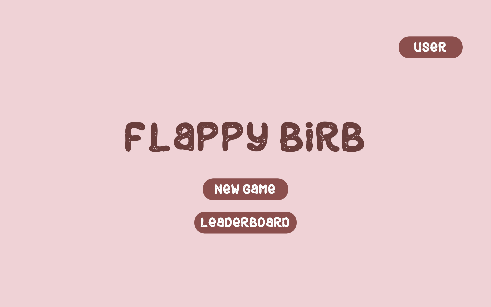
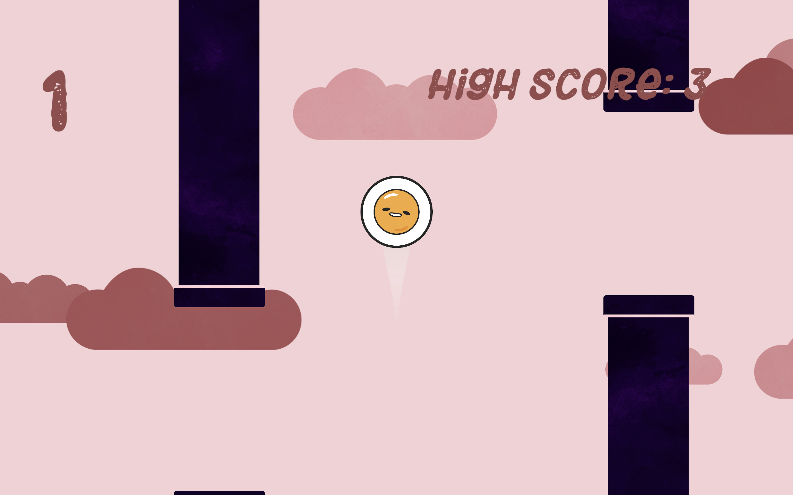
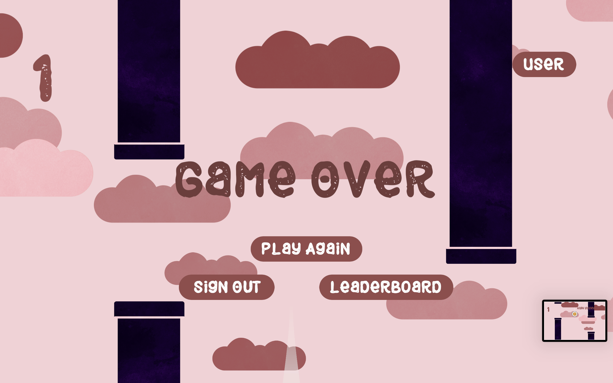
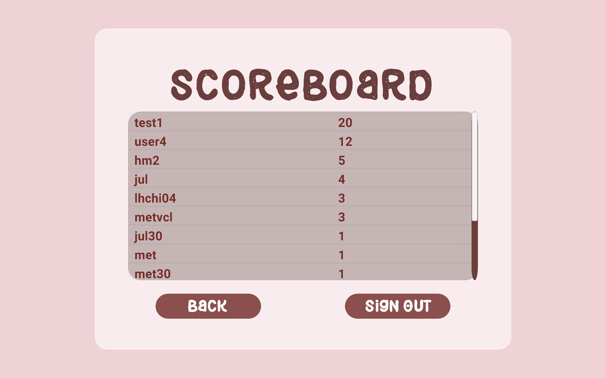
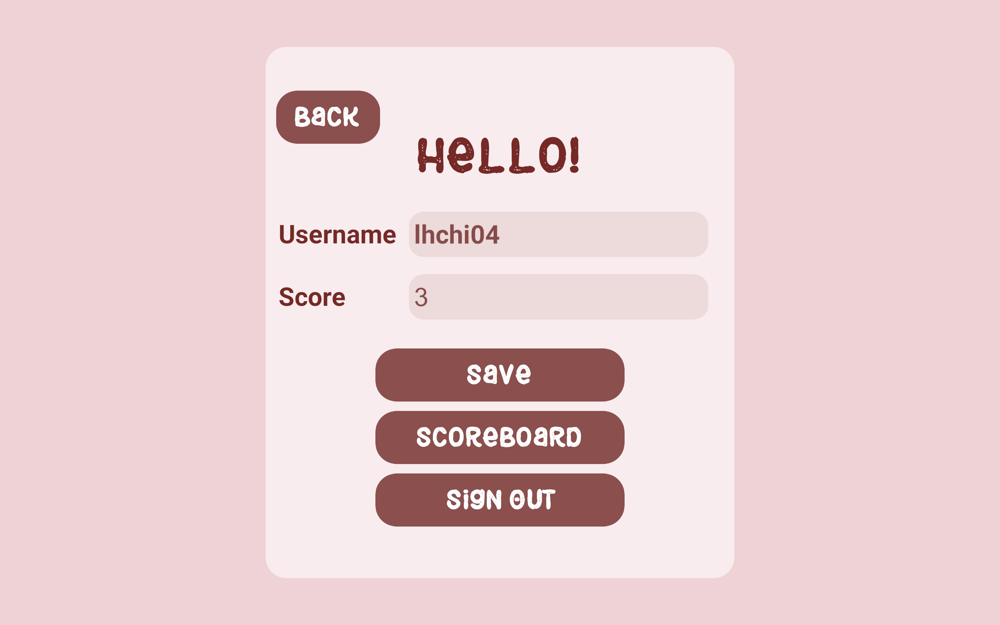

# Flappy-Birb

This project is a recreation of the popular Flappy Bird game, developed using **Unity** and **C#**. The game features user authentication and a leaderboard that displays the top scores, stored and retrieved using **Firebase** services.

## Features

- **Engaging Gameplay**: Players can control the bird's flight using simple controls. The goal is to navigate through obstacles and achieve the highest score.
- **Firebase Authentication**: Players can sign up or log in to access the game securely.
- **Leaderboard**: The game uses Firebase Realtime Database to store and retrieve player scores, updating the leaderboard in real-time.

## Screenshots

## Technologies Used

- **Unity**: Used to design the game environment, handle physics, and implement game mechanics.
- **C#**: Used for scripting and controlling game logic.
- **Firebase Authentication**: Ensures secure user login and account management.
- **Firebase Realtime Database**: Stores player scores and updates the leaderboard in real-time.

## How to Play
- Press the spacebar or tap the screen to make the bird fly.
- Navigate through the pipes without hitting them.
- The further you go, the higher your score!

## Future Improvements
- Add more levels or difficulty modes.
- Implement social media sharing for high scores.
